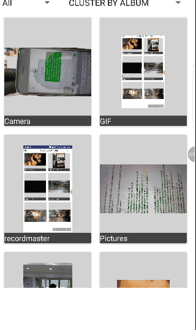

# Medialibrary

[  ](https://bintray.com/mayurkoul2002/Awesome-Android/medialibrary/_latestVersion)
[](https://travis-ci.org/mayurkaul/medialibrary)

This library is inspired with the Album structure of the Android Gallery and has abstracted library to get the Albums Data structure for Photos, Videos or All based on the Clustering of Photos based on Album, time, location, Tag, Size, etc.



## Installation ##

add mavencentral to all repositories of your root build.gradle file

```gradle
allprojects {
    repositories {
        mavenCentral()
    }
}
```
Then in your project's build gradle, add the following dependancy

```gradle
dependencies {
    compile 'com.github.mayurkaul:medialibrary:1.0.1'
}
```
And you are all set !!!

Initialisation and usage of the library can be found in [Link to Wiki](https://github.com/mayurkaul/medialibrary/wiki/Initialisation)

You can also have a look at the sample code in [Samples](https://github.com/mayurkaul/medialibrary/tree/master/sample)
